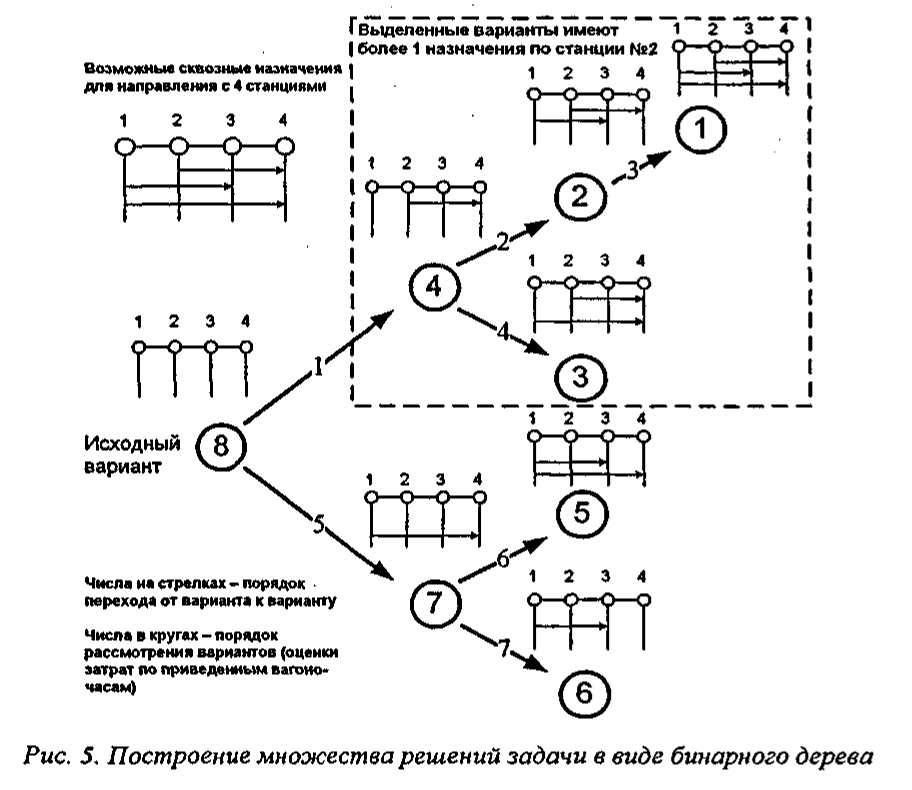
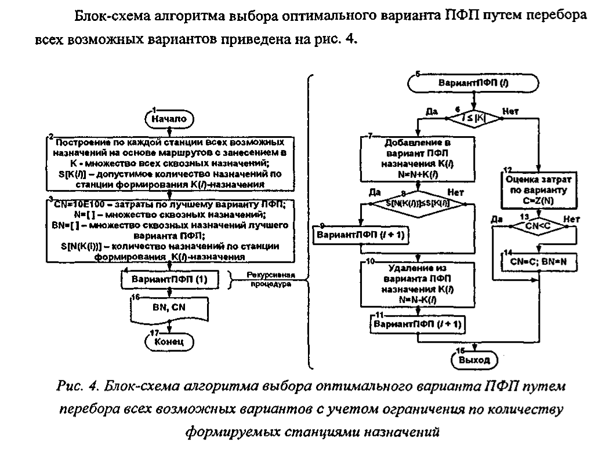
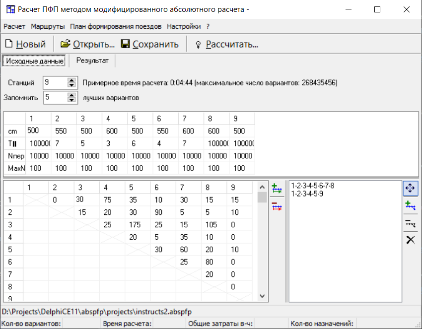
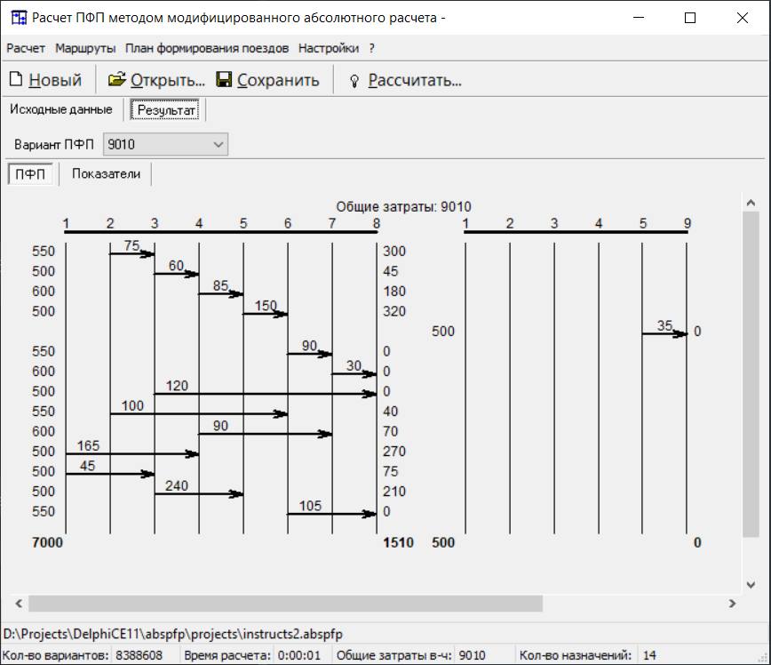

# abspfp
Расчет плана формирования поездов методом абсолютного (полного) перебора

## Idea

Для расчета лучшего варианта по критерию вагоночасы делается построение всех возможных вариантов вагонопотоков и их оценка.

Обход этого бинарного дерева ведется упорядоченно, сначала идет обход одной ветви (числа на стрелках обозначают порядок перехода
от варианта к варианту, числа в кружках показывают порядок рассмотрения вариантов), затем другой. Это позволяет дробить задачу в любом узле на две
практически равные части и решать их независимо от других частей. Применение параллельных вычислений с выпуском многоядерных процессоров позволило
задействовать все возможности современной вычислительной техники и получить от этого значительное ускорение расчетов.

Алгоритм построения такого упорядоченного графа выглядит следующим образом.

## Usage

Запустите приложение и введите исходные данные.
Можно загрузить примеры данных для расчета из папки Projects

После расчета получаем результат в графическом виде, их можно скопировать кликом правой кнопки мыши. Показатели можно экспортировать в Excel. 

### Code

This is Delphi application with Assembler inline code, compiled conditionally. 2x speed up is archived when Assembler rewritten code is used. 
May be used as example for using Assembler wuth Deplhi. Conditional ASMALGN is enabling usage of assembler code. 

Assembler code (and other Deplhi code) is for 32-bit environment.

### Releases

For direct downloads, check out [Releases](../../releases).

## Contributing

For simple bug reports and fixes, and feature requests, please simply use projects
[Issue Tracker](../../issues)

